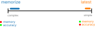
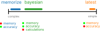
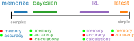
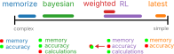

## Cognitive Neuroscience

:::: {.columns}

::: {.column width="50%"}
::: {.image-card}
{style="height: 480px; width: auto;"}
:::
:::

::: {.column width="50%"}
::: {.image-card}
{style="height: 480px; width: auto;"}
:::
:::

::::

## Evidence Integration

::: {.image-card}
{width="85%"}
:::

## Behavioral Experiments (old)

::: {.image-card}
{width="90%"}
:::

## Behavioral Experiments (new)

::: {.image-card}
{width="90%"}
:::

## Responses improve with data

::: {.image-card}
{width="85%"}
:::

## Theories and Models

::: {.r-stack}

::: {.image-card}
{width="90%"}
:::

::: {.fragment .image-card fragment-index="1"}
{width="90%"}
:::

::: {.fragment .image-card fragment-index="2"}
{width="90%"}
:::

::: {.fragment .image-card fragment-index="3"}
{width="90%"}
:::

::: {.fragment .image-card fragment-index="4"}
{width="90%"}
:::

:::

## Weighted Prediction Error

People update beliefs using *prediction error*

::: {.fragment}
$$V_n = V_{n-1} + \textcolor{#d62728}{\frac{\alpha_0}{n^{\lambda}}} (V_{n-1} - I_n)$$
:::

::: {.fragment}
::: {.image-card}
{style="height: 200px; width: auto;"}
:::
:::

## Spiking Neural Network Model

::: {.image-card}
{width="90%"}
:::

## Neural Dynamics

::: {.image-card}
{width="90%"}
:::

## Model Performance

::: {.image-card}
{width="90%"}
:::
