## Cognitive Neuroscience

:::: {.columns}

::: {.column width="50%"}
::: {.image-card}
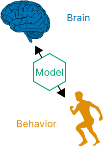{style="height: 480px; width: auto;"}
:::
:::

::: {.column width="50%"}
::: {.image-card}
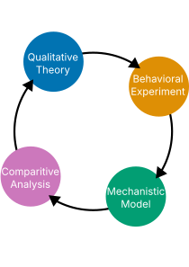{style="height: 480px; width: auto;"}
:::
:::

::::

## Evidence Integration

::: {.image-card}
{width="85%"}
:::

## Behavioral Experiments (old)

::: {.image-card}
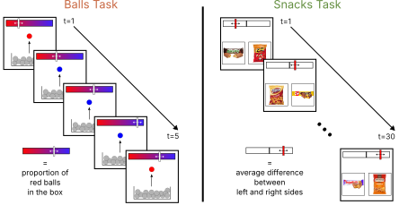{width="90%"}
:::

## Behavioral Experiments (new)

::: {.image-card}
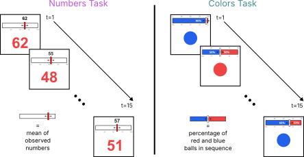{width="90%"}
:::

## People Learn as they Gather Data

::: {.image-card}
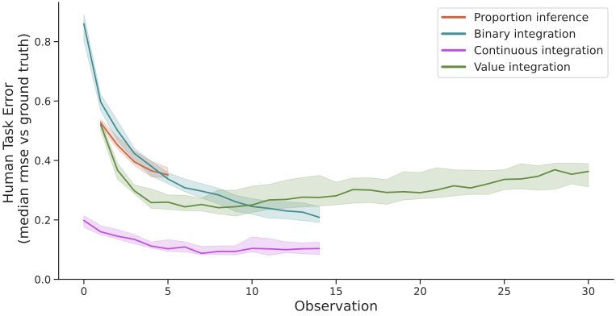{width="90%"}
:::

## Theories and Models

::: {.image-card}
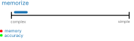{#theories-img width="90%"}
:::

[]{.fragment fragment-index="1" data-swap-target="theories-img" data-swap-src="images/complexity_2.svg" data-swap-prev="images/complexity_1.svg"}
[]{.fragment fragment-index="2" data-swap-target="theories-img" data-swap-src="images/complexity_3.svg" data-swap-prev="images/complexity_2.svg"}
[]{.fragment fragment-index="3" data-swap-target="theories-img" data-swap-src="images/complexity_4.svg" data-swap-prev="images/complexity_3.svg"}
[]{.fragment fragment-index="4" data-swap-target="theories-img" data-swap-src="images/complexity_5.svg" data-swap-prev="images/complexity_4.svg"}

## Weighted Prediction Error

HYP: People update beliefs using *prediction error*

::: {.fragment}
$$V_n = V_{n-1} + \textcolor{#d62728}{\frac{\alpha_0}{n^{\lambda}}} (V_{n-1} - I_n)$$
:::

::: {.fragment}
::: {.image-card}
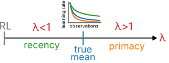{style="height: 200px; width: auto;"}
:::
:::

## Spiking Neural Network Model

::: {.image-card}
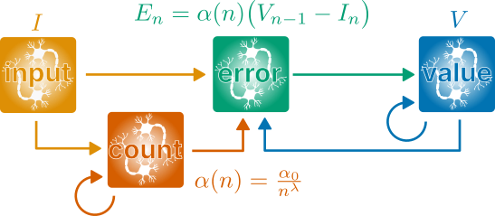{width="90%"}
:::

## Neural Dynamics

::: {.image-card}
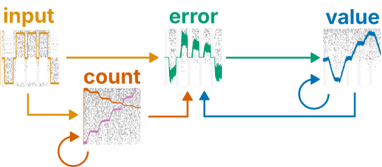{width="90%"}
:::

## Model Captures Behavior (rmse)

::: {.image-card}
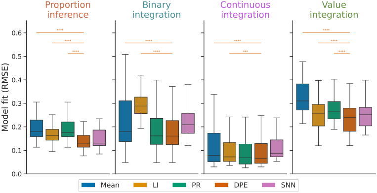{width="90%"}
:::

## Smaller Updates Over Time ($\lambda$)

::: {.image-card}
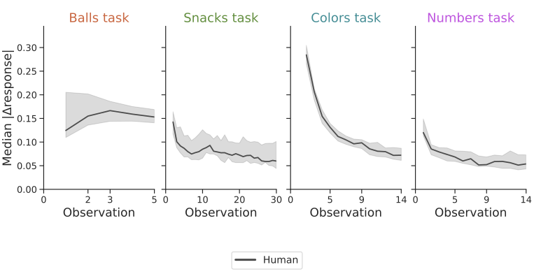{#response-change-img width="90%"}
:::

[]{.fragment fragment-index="1" data-swap-target="response-change-img" data-swap-src="figures/response_change_full.svg" data-swap-prev="figures/response_change_human.svg"}

## Individual Differences in $\lambda$

::: {.image-card}
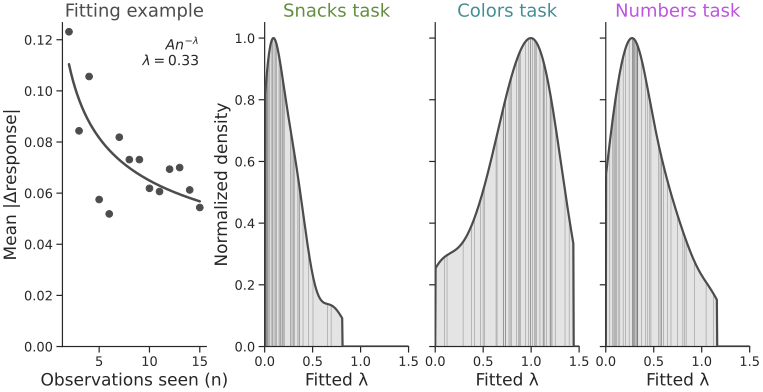{width="90%"}
:::

## $\lambda$ Consistent Over Trials/Tasks

::: {.image-card}
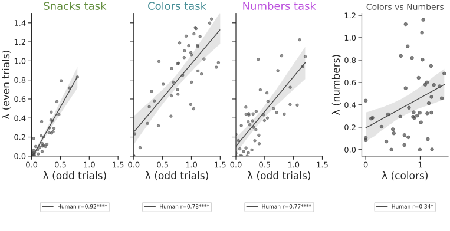{width="90%"}
:::

## Models Capture $\lambda$ Differences

::: {.image-card}
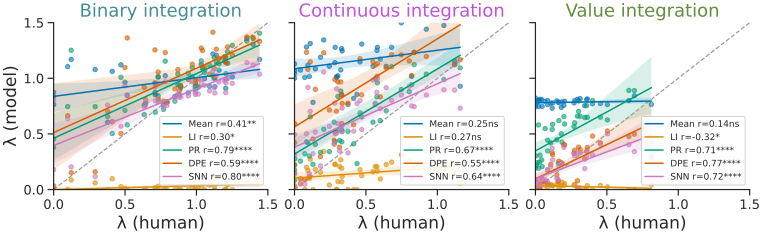{width="90%"}
:::

## People have Noisy Responses ($\sigma$)

::: {.image-card}
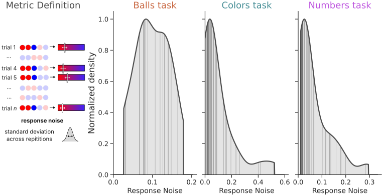{width="90%"}
:::

## $\sigma$ Consistent Over Trials/Tasks

::: {.image-card}
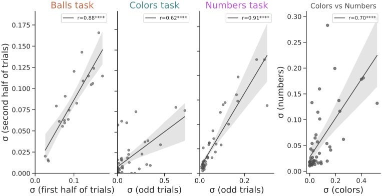{width="90%"}
:::

## Models Capture $\sigma$ Differences

::: {.image-card}
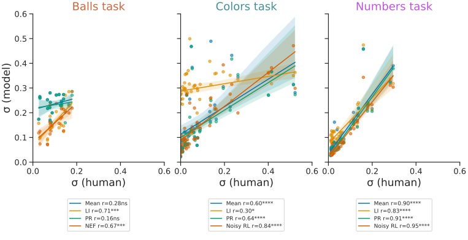{width="90%"}
:::

## Noise is Autocorrelated

::: {.image-card}
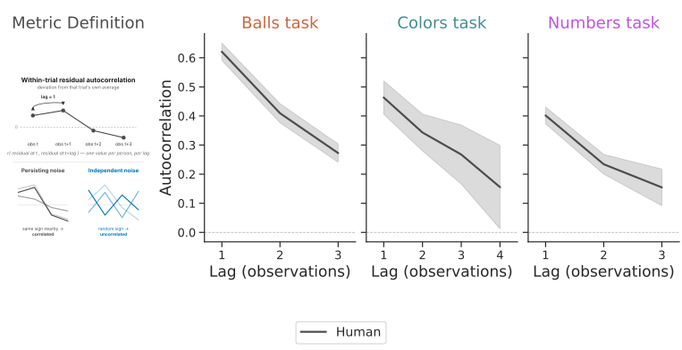{width="90%"}
:::

## Noise is Autocorrelated

::: {.image-card}
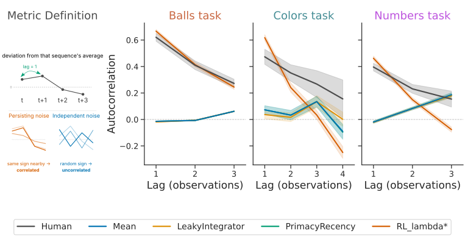{width="90%"}
:::

## Model Captures Behavior (nll)

::: {.image-card}
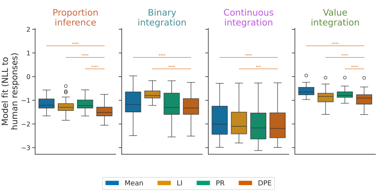{width="90%"}
:::

## Prediction Error & Neural Activity

::: {.image-card}
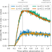{width="50%"}
:::

## PE variance drives $\sigma$

::: {.image-card}
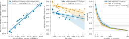{width="100%"}
:::

## $\lambda$ drives discounting

::: {.image-card}
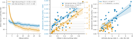{width="100%"}
:::

## Conclusions

:::: {.columns style="display: flex; gap: 2em;"}

::: {.column width="50%"}
#### Evidence Integration

::: {.nonincremental}
* Error-driven learning
* Four cognitive tasks
* Individual differences
:::
:::

::: {.column width="50%"}
#### Spiking Neural Network

::: {.nonincremental}
* Captures human data
* Explains neural mechanisms
* Makes novel predictions
:::
:::

::::

::: {.image-card style="margin: 1em auto 0 auto;"}
{style="height: 200px; width: auto; display: block; margin: 0 auto;"}
:::

## Acknowledgments {.smaller}

::: {style="display: flex; justify-content: space-evenly; width: 100%; min-width: 100%; box-sizing: border-box;"}
{style="height: 110px; width: 110px; object-fit: cover; border-radius: 8px;"}
{style="height: 110px; width: 110px; object-fit: cover; border-radius: 8px;"}
{style="height: 110px; width: 110px; object-fit: cover; border-radius: 8px;"}
{style="height: 110px; width: 110px; object-fit: cover; border-radius: 8px;"}
:::

Neural Engineering Framework

::: {style="font-size: 0.6em;"}
Eliasmith, Chris, and Charles H Anderson. 2003. Neural Engineering: Computation, Representation, and Dynamics in Neurobiological Systems. Cambridge, MA: MIT press.
:::

Balls Task / Data

::: {style="font-size: 0.6em;"}
Prat-Carrabin, Arthur, and Michael Woodford. 2024. “Imprecise Probabilistic Inference from Sequential Data.” Psychological Review 131.
:::

Snacks Task / Data

::: {style="font-size: 0.6em;"}
Yoo, Minhee, Giwon Bahg, Brandon Turner, and Ian Krajbich. 2025. “People Display Consistent Recency and Primacy Effects in Behavior and Neural Activity Across Perceptual and Value-Based Judgments.” Cognitive, Affective, & Behavioral Neuroscience 25. 
:::