## Cognitive Neuroscience

:::: {.columns}

::: {.column width="50%"}
::: {.image-card}
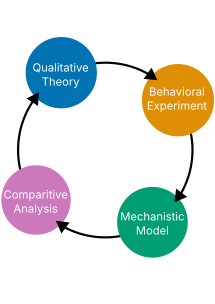{style="height: 480px; width: auto;"}
:::
:::

::: {.column width="50%"}
::: {.image-card}
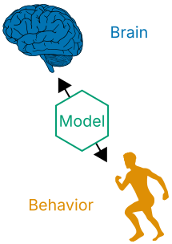{style="height: 480px; width: auto;"}
:::
:::

::::

## Evidence Integration

::: {.image-card}
{width="100%"}
:::

## Behavioral Experiments

::: {.image-card}
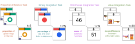{width="100%"}
:::

## People Learn as they Gather Data

::: {.image-card}
{width="100%"}
:::

## Cognitive Algorithms

::: {.image-card}
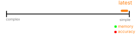{#theories-img width="100%"}
:::

[]{.fragment fragment-index="1" data-swap-target="theories-img" data-swap-src="figures/complexity_2.svg" data-swap-prev="figures/complexity_1.svg"}
[]{.fragment fragment-index="2" data-swap-target="theories-img" data-swap-src="figures/complexity_3.svg" data-swap-prev="figures/complexity_2.svg"}
[]{.fragment fragment-index="3" data-swap-target="theories-img" data-swap-src="figures/complexity_4.svg" data-swap-prev="figures/complexity_3.svg"}
[]{.fragment fragment-index="4" data-swap-target="theories-img" data-swap-src="figures/complexity_5.svg" data-swap-prev="figures/complexity_4.svg"}

## Theory and Model

::: {.image-card}
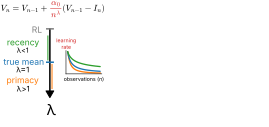{#models-overview-img width="100%"}
:::

[]{.fragment fragment-index="1" data-swap-target="models-overview-img" data-swap-src="figures/models_overview_presentation_2.svg" data-swap-prev="figures/models_overview_presentation_1.svg"}
[]{.fragment fragment-index="2" data-swap-target="models-overview-img" data-swap-src="figures/models_overview_presentation_3.svg" data-swap-prev="figures/models_overview_presentation_2.svg"}

## Model Captures Behavior

::: {.image-card}
{width="100%"}
:::

## Smaller Updates Over Time ($\lambda$)

::: {.image-card}
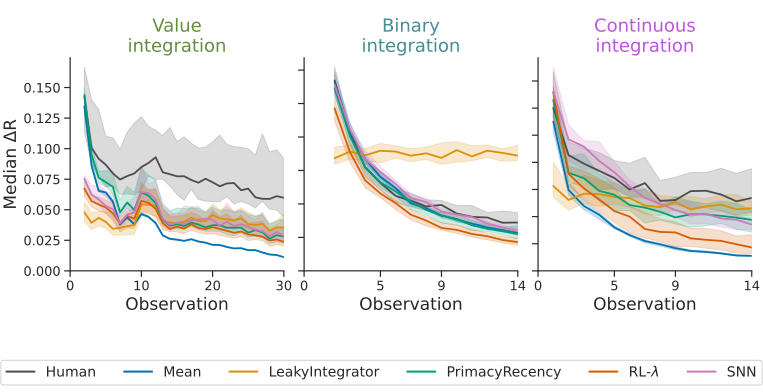{width="100%"}
:::

## Individual Differences in $\lambda$

::: {.image-card}
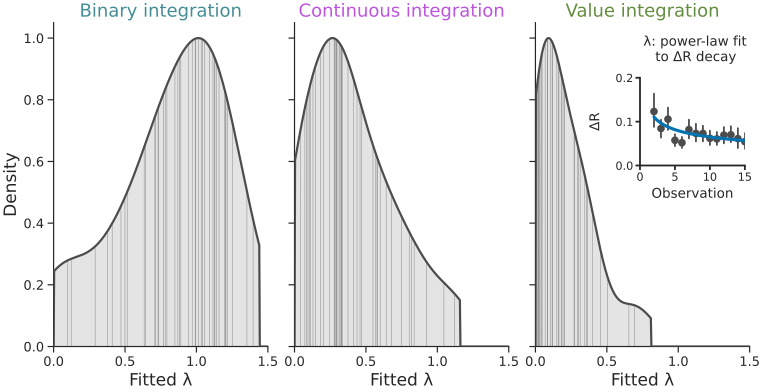{width="100%"}
:::

## People have Noisy Responses ($\sigma$)

::: {.image-card}
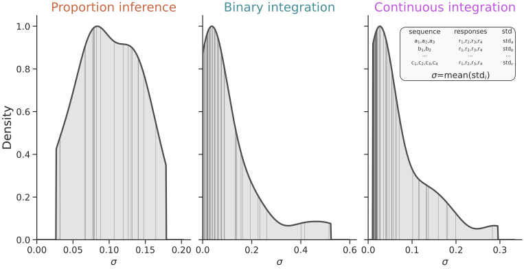{width="100%"}
:::

## Response Noise Autocorrelation

::: {.image-card}
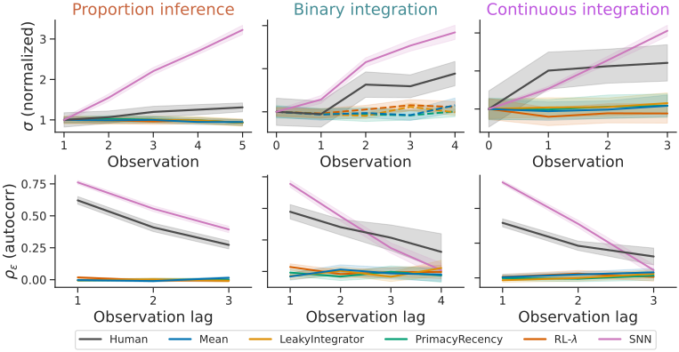{width="100%"}
:::

## $\alpha_0$ drives PE Dynamics

::: {.image-card}
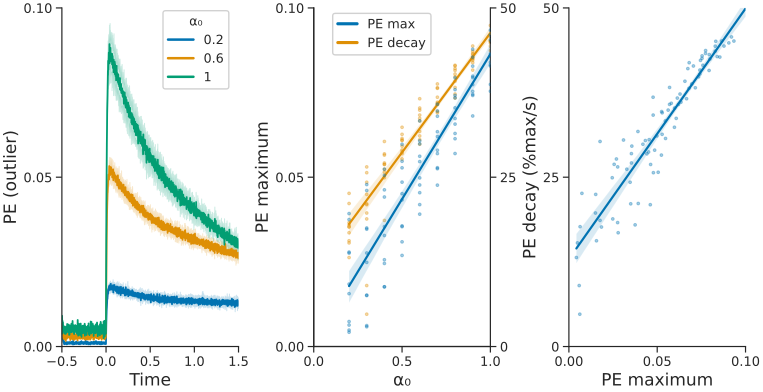{width="100%"}
:::

## PE variance drives $\sigma$

::: {.image-card}
{width="100%"}
:::

## $\lambda$ drives discounting

::: {.image-card}
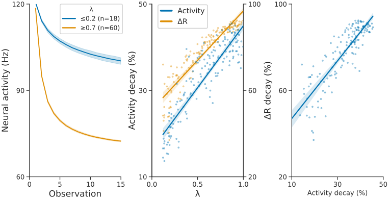{width="100%"}
:::

## Synaptic implementation (PES)

::: {.image-card}
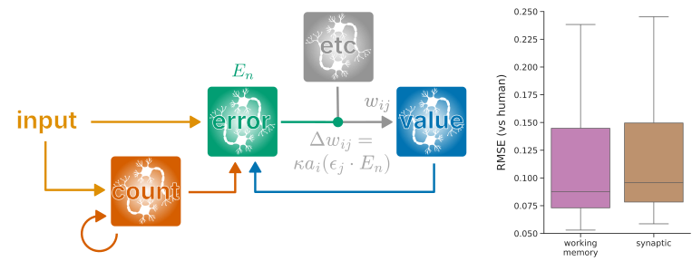{width="100%"}
:::

## Syn reistant to perturbation

::: {.image-card}
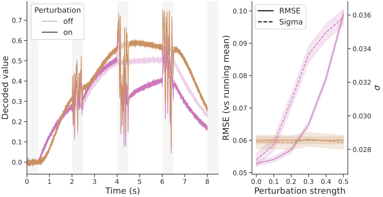{width="100%"}
:::

## Conclusions

:::: {.columns style="display: flex; gap: 2em;"}

::: {.column width="50%"}
#### Evidence Integration

::: {.nonincremental}
* Error-driven learning
* Four cognitive tasks
* Individual differences
:::
:::

::: {.column width="50%"}
#### Spiking Neural Network

::: {.nonincremental}
* Captures human data
* Explains neural mechanisms
* Makes novel predictions
:::
:::

::::

::: {.image-card style="margin: 1em auto 0 auto;"}
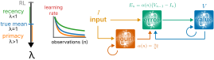{style="height: 200px; width: auto; display: block; margin: 0 auto;"}
:::

## Acknowledgments {.smaller}

::: {style="display: flex; justify-content: space-evenly; width: 100%; min-width: 100%; box-sizing: border-box;"}
{style="height: 110px; width: 110px; object-fit: cover; border-radius: 8px;"}
{style="height: 110px; width: 110px; object-fit: cover; border-radius: 8px;"}
{style="height: 110px; width: 110px; object-fit: cover; border-radius: 8px;"}
{style="height: 110px; width: 110px; object-fit: cover; border-radius: 8px;"}
:::

Neural Engineering Framework

::: {style="font-size: 0.6em;"}
Eliasmith, Chris, and Charles H Anderson. 2003. Neural Engineering: Computation, Representation, and Dynamics in Neurobiological Systems. Cambridge, MA: MIT press.
:::

Proportion Inference Task / Data

::: {style="font-size: 0.6em;"}
Prat-Carrabin, Arthur, and Michael Woodford. 2024. “Imprecise Probabilistic Inference from Sequential Data.” Psychological Review 131.
:::

Value Integration Task / Data

::: {style="font-size: 0.6em;"}
Yoo, Minhee, Giwon Bahg, Brandon Turner, and Ian Krajbich. 2025. “People Display Consistent Recency and Primacy Effects in Behavior and Neural Activity Across Perceptual and Value-Based Judgments.” Cognitive, Affective, & Behavioral Neuroscience 25.
:::

## $\lambda$ Consistent Over Trials/Tasks

::: {.image-card}
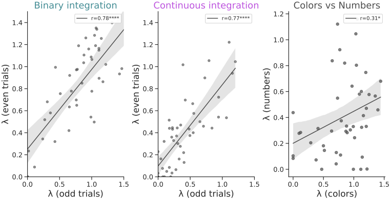{width="100%"}
:::

## $\sigma$ Consistent Over Trials/Tasks

::: {.image-card}
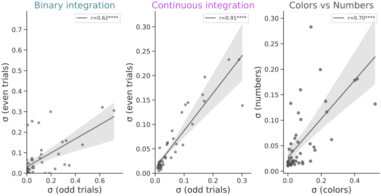{width="100%"}
:::

## Model performance (NLL)

::: {.image-card}
{width="100%"}
:::

## Proportion Inference: $\lambda=0$

::: {.image-card}
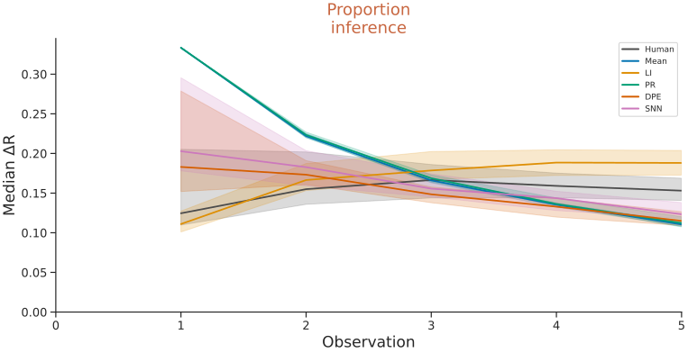{width="100%"}
:::